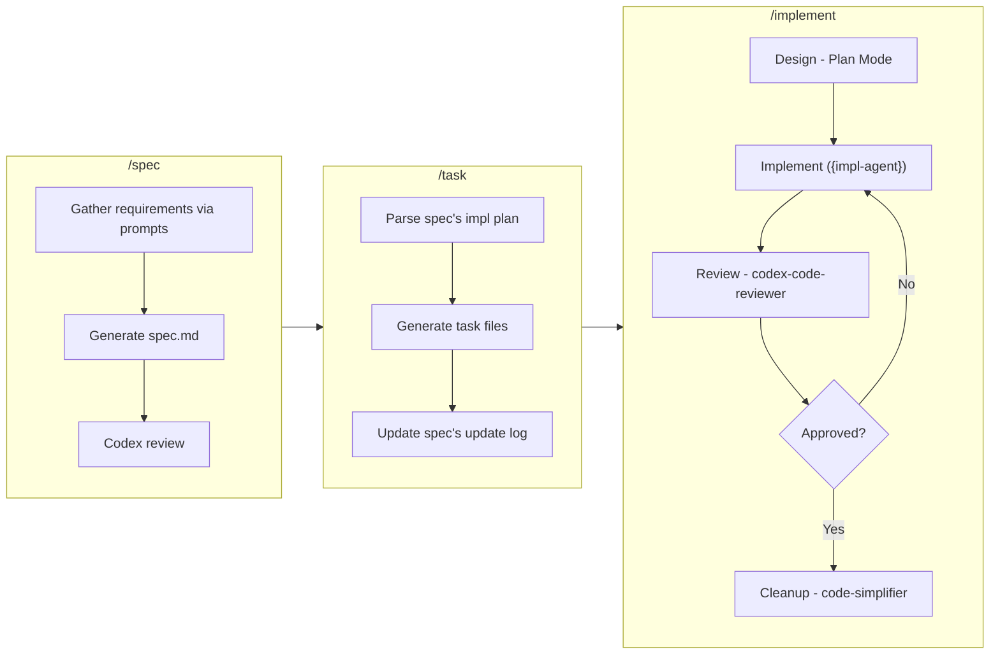

# claude-code-template

A template repository for [Claude Code](https://claude.ai/code) that provides a multi-agent development workflow with integrated specification management, code review, and iterative improvement cycles.

## Motivation

Claude Code's main agent acts as an **orchestrator**, delegating tasks to specialized sub-agents. Each agent runs in its own context, which means:

- **Implementation** and **review** happen in separate contexts, preventing bias and enabling objective quality assessment.
- Complex tasks are broken down and handled by purpose-built agents (e.g., a Rust expert, a TypeScript expert, a dedicated reviewer), producing higher-quality output than a single monolithic prompt.
- The iterative cycle of implement → review → fix continues until quality gates are met, without polluting any single agent's context window.

This separation of concerns allows you to tackle more complex tasks with more reliable, high-quality results.

## Getting Started

1. Clone this repository into your project (or use it as a GitHub template):

   ```bash
   git clone https://github.com/adachi-440/claude-code-template.git
   ```

2. Run `/init` in Claude Code — `CLAUDE.md` and `.claude/settings.local.json` will be automatically configured for your project.

3. Start using the skills:

   ```bash
   /spec my-feature
   /task my-feature
   /implement "Implement task_001 based on docs/specs/my-feature/tasks/task_001_xxx.md"
   ```

## Development Workflow

A spec-to-implementation pipeline:



### 1. `/spec [feature-name]` — Create a Specification

Interactively generates a feature specification document.

- Explores the codebase to gather context about relevant modules and patterns.
- Prompts you for overview, goals, background, non-goals, and technical constraints.
- Generates `docs/specs/{feature}/spec.md` from the template.
- Runs a Codex review (Spec Review mode) on the generated spec.
- Creates `docs/specs/{feature}/tasks/` directory for the next step.

### 2. `/task [feature-name]` — Generate Task Breakdown

Parses the implementation plan from a specification and generates individual task files.

- Reads the spec's "Implementation Plan" or "Task Breakdown" section.
- Creates numbered task files (`task_{NNN}_{slug}.md`) under `docs/specs/{feature}/tasks/`.
- Optionally refines each task interactively (description, files to modify, dependencies).
- Updates the parent spec's Update Log with task references.

### 3. `/implement [task description]` — Iterative Implementation with Review

Executes a full implement-review cycle with automatic agent selection.

- **Agent selection**: Analyzes the task context (file extensions, project config) and picks the appropriate implementation agent.
- **Design** (optional): Enters plan mode for non-trivial changes, proposes an approach for approval.
- **Implement**: The selected agent writes code, tests, and documentation.
- **Review**: `codex-code-reviewer` performs a comprehensive review via Codex CLI — results are always shared with you.
- **Iterate**: Addresses review feedback and re-reviews (up to 3 cycles).
- **Cleanup**: `code-simplifier` refines the final code for clarity and maintainability.
- **Summary**: Provides a suggested commit message.

## Skills

| Skill | Arguments | Description |
|-------|-----------|-------------|
| `/spec` | `[feature-name]` | Interactively create a feature specification at `docs/specs/{feature}/spec.md` |
| `/task` | `[feature-name]` or `[spec-path]` | Parse the spec's implementation plan and generate individual task files |
| `/implement` | `[task description]` | Execute an iterative cycle: auto-select agent → design → implement → review → iterate → cleanup |
| `/ask-codex` | `[query]` | Run Codex CLI (`codex exec`) for ad-hoc coding assistance, debugging, or review |

## Agents

All agents use `model: opus`.

| Agent | Role | Description |
|-------|------|-------------|
| `rust-engineer` | Implementation | Write Rust code with memory safety, ownership patterns, and zero-cost abstractions |
| `typescript-engineer` | Implementation | Write TypeScript code with advanced type system patterns and strict type safety |
| `python-engineer` | Implementation | Write Python code with type hints, async patterns, and modern 3.11+ best practices |
| `codex-code-reviewer` | Review | Delegate review to OpenAI Codex CLI. Supports Full Review, Validation Review, and Spec Review modes. Never writes code — only returns structured findings |
| `code-simplifier` (built-in) | Cleanup | Simplify and refine code as the final phase after implementation iterations pass review |

Implementation agents are selected automatically by `/implement` based on task context (file extensions, project config, codebase analysis). If no specialized agent fits, `general-purpose` is used.

## Repository Structure

```
.claude/
├── agents/                        # Specialized agent definitions
│   ├── rust-engineer.md
│   ├── typescript-engineer.md
│   ├── python-engineer.md
│   └── codex-code-reviewer.md
├── skills/                        # Skill (slash command) definitions
│   ├── spec/
│   │   ├── SKILL.md
│   │   └── spec-template.md       # Specification template
│   ├── task/
│   │   ├── SKILL.md
│   │   └── task-template.md       # Task template
│   ├── implement/
│   │   └── SKILL.md
│   └── ask-codex/
│       └── SKILL.md
└── settings.local.json            # Permission settings
CLAUDE.md                          # Guidance for Claude Code instances
docs/specs/                        # Generated specs and tasks (created by skills)
```

## Prerequisites

- [Claude Code CLI](https://claude.ai/code)
- [Codex CLI](https://github.com/openai/codex) — required for `/ask-codex` and the `codex-code-reviewer` agent
- [code-simplifier](https://github.com/anthropics/claude-code/tree/main/plugins/code-simplifier) plugin — required for the Cleanup Phase. Install with:
  ```bash
  claude plugin add code-simplifier
  ```

## License

MIT
