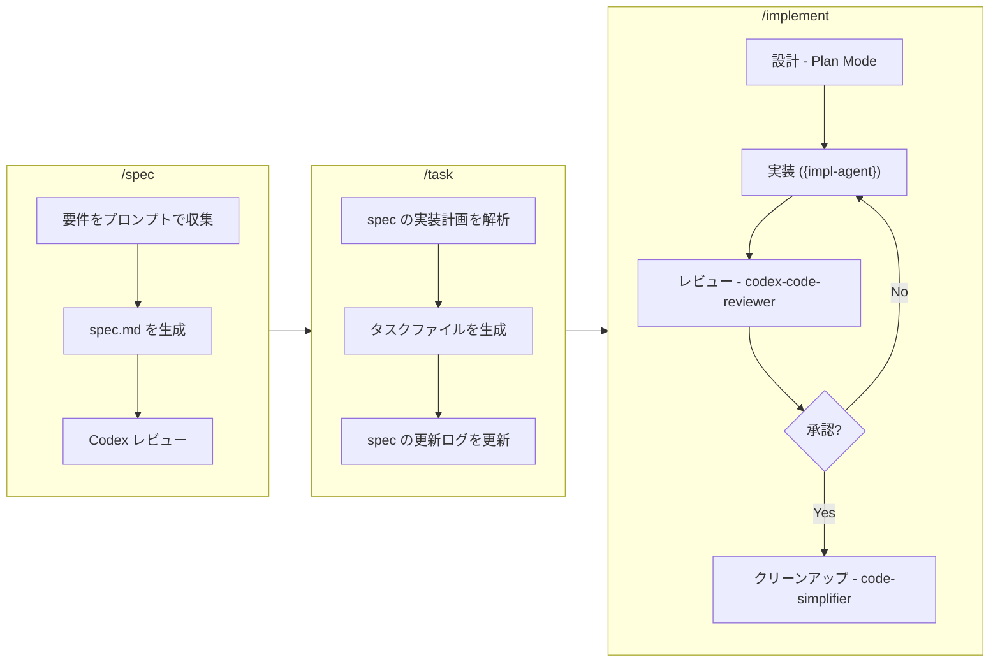

# claude-code-template

[Claude Code](https://claude.ai/code) 向けのテンプレートリポジトリです。マルチエージェントによる開発ワークフロー、仕様管理、コードレビュー、反復的な品質改善サイクルを提供します。

## モチベーション

Claude Code のメインエージェントを**オーケストレーター**として機能させ、専門的なサブエージェントにタスクを委譲するアーキテクチャです。各エージェントは独立したコンテキストで動作するため、以下のメリットがあります。

- **実装**と**レビュー**が別コンテキストで実行されるため、バイアスを排除し客観的な品質評価が可能
- 複雑なタスクを専門エージェント（Rust エキスパート、TypeScript エキスパート、専任レビュアーなど）が担当するため、単一プロンプトより高品質なアウトプットを生成
- 実装 → レビュー → 修正の反復サイクルが品質ゲートを満たすまで継続し、各エージェントのコンテキストウィンドウを汚染しない

この関心の分離により、より複雑なタスクに対して、より信頼性の高い高品質な成果物を得ることができます。

## はじめに

1. このリポジトリをクローン（または GitHub テンプレートとして使用）:

   ```bash
   git clone https://github.com/adachi-440/claude-code-template.git
   ```

2. Claude Code で `/init` を実行 — `CLAUDE.md` と `.claude/settings.local.json` がプロジェクトに合わせて自動設定される

3. スキルを使い始める:

   ```bash
   /spec my-feature
   /task my-feature
   /implement "Implement task_001 based on docs/specs/my-feature/tasks/task_001_xxx.md"
   ```

## 開発ワークフロー

仕様策定から実装までのパイプラインを提供します。



### 1. `/spec [feature-name]` — 仕様書の作成

対話的に機能仕様書を生成します。

- コードベースを探索し、関連モジュールやパターンのコンテキストを収集
- 概要、目標、背景、非目標、技術的制約についてプロンプトで確認
- テンプレートから `docs/specs/{feature}/spec.md` を生成
- 生成された仕様書に対して Codex レビュー（Spec Review モード）を実行
- 次のステップ用に `docs/specs/{feature}/tasks/` ディレクトリを作成

### 2. `/task [feature-name]` — タスク分割

仕様書の実装計画を解析し、個別のタスクファイルを生成します。

- 仕様書の「実装計画」または「タスク分割」セクションを読み取り
- `docs/specs/{feature}/tasks/` 配下に番号付きタスクファイル（`task_{NNN}_{slug}.md`）を作成
- 各タスクを対話的に詳細化（説明、変更ファイル、依存関係）するオプション付き
- 親仕様書の更新ログにタスク参照を追加

### 3. `/implement [task description]` — 反復的な実装とレビュー

エージェントの自動選択による実装・レビューサイクルを実行します。

- **エージェント選択**: タスクのコンテキスト（ファイル拡張子、プロジェクト設定）を分析し、適切な実装エージェントを選択
- **設計**（任意）: 非自明な変更の場合、Plan Mode でアプローチを提案し承認を取得
- **実装**: 選択されたエージェントがコード、テスト、ドキュメントを作成
- **レビュー**: `codex-code-reviewer` が Codex CLI 経由で包括的なレビューを実施（結果は必ずユーザーに共有）
- **反復**: レビューフィードバックに対応し再レビュー（最大3サイクル）
- **クリーンアップ**: `code-simplifier` がコードの可読性・保守性を向上
- **サマリー**: コミットメッセージの提案

## Skills

| Skill | 引数 | 説明 |
|-------|------|------|
| `/spec` | `[feature-name]` | `docs/specs/{feature}/spec.md` に機能仕様書を対話的に作成 |
| `/task` | `[feature-name]` or `[spec-path]` | 仕様書の実装計画を解析し、個別のタスクファイルを生成 |
| `/implement` | `[task description]` | エージェント自動選択 → 設計 → 実装 → レビュー → 反復 → クリーンアップの一連サイクルを実行 |
| `/ask-codex` | `[query]` | Codex CLI（`codex exec`）によるコーディング支援、デバッグ、レビュー |

## Agents

全エージェントは `model: opus` を使用。

| Agent | 役割 | 説明 |
|-------|------|------|
| `rust-engineer` | 実装 | メモリ安全性、所有権パターン、ゼロコスト抽象化を重視した Rust コードの実装 |
| `typescript-engineer` | 実装 | 高度な型システムパターンと厳密な型安全性を持つ TypeScript コードの実装 |
| `python-engineer` | 実装 | 型ヒント、非同期パターン、Python 3.11+ のベストプラクティスに基づく実装 |
| `codex-code-reviewer` | レビュー | OpenAI Codex CLI にレビューを委譲。Full Review、Validation Review、Spec Review モードに対応。コードは書かず、構造化されたフィードバックのみ返却 |
| `code-simplifier`（組み込み） | クリーンアップ | 実装の反復がレビューを通過した後の最終フェーズとして、コードの簡素化・整理を実施 |

実装エージェントは `/implement` がタスクのコンテキスト（ファイル拡張子、プロジェクト設定、コードベース分析）に基づいて自動選択します。適切な専門エージェントがない場合は `general-purpose` を使用します。

## リポジトリ構成

```
.claude/
├── agents/                        # 専門エージェント定義
│   ├── rust-engineer.md
│   ├── typescript-engineer.md
│   ├── python-engineer.md
│   └── codex-code-reviewer.md
├── skills/                        # スキル（スラッシュコマンド）定義
│   ├── spec/
│   │   ├── SKILL.md
│   │   └── spec-template.md       # 仕様書テンプレート
│   ├── task/
│   │   ├── SKILL.md
│   │   └── task-template.md       # タスクテンプレート
│   ├── implement/
│   │   └── SKILL.md
│   └── ask-codex/
│       └── SKILL.md
└── settings.local.json            # 権限設定
CLAUDE.md                          # Claude Code インスタンスへのガイダンス
docs/specs/                        # 生成された仕様書・タスク（スキルにより作成）
```

## 前提条件

- [Claude Code CLI](https://claude.ai/code)
- [Codex CLI](https://github.com/openai/codex) — `/ask-codex` および `codex-code-reviewer` エージェントに必要
- [code-simplifier](https://github.com/anthropics/claude-code/tree/main/plugins/code-simplifier) プラグイン — Cleanup Phase に必要。以下でインストール:
  ```bash
  claude plugin add code-simplifier
  ```

## ライセンス

MIT
